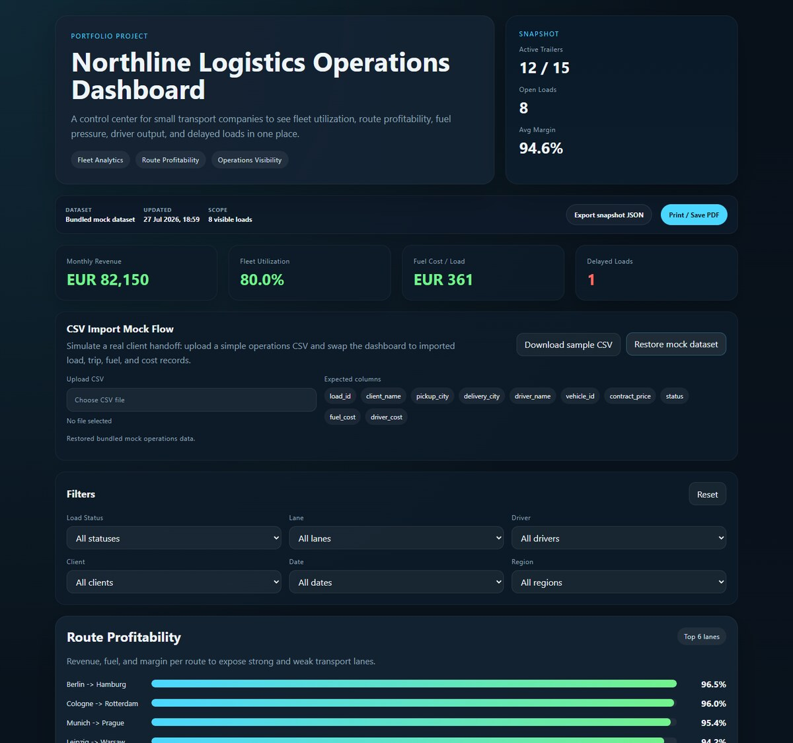

# Northline Logistics Operations Dashboard

A portfolio-grade operations dashboard for a small transport company. It turns raw load, trip, fuel, driver, and cost records into a practical decision-support view.



## What it demonstrates

- KPI calculation from raw operational records
- fleet utilization and route profitability analysis
- fuel-cost and driver-performance monitoring
- delayed and at-risk load detection
- interactive filtering across status, lane, driver, client, date, and region
- accessible load selection with a detailed trip and cost drawer
- CSV import for a realistic client handoff flow
- filtered JSON snapshot export
- print-ready reporting for PDF or paper
- responsive desktop and mobile layouts

## Live demo

[Open the dashboard](https://sandro-abashishvili.sandroabashishvili.chatgpt.site/demos/logistics/)

## Run locally

The project has no build step and no package dependencies. Serve the folder with any static HTTP server:

```bash
python3 -m http.server 8000
```

Then open `http://localhost:8000`.

## CSV import

Use [data/sample_import.csv](data/sample_import.csv) to test the import workflow. Required columns:

```text
load_id, client_name, pickup_city, delivery_city, driver_name,
vehicle_id, contract_price, status, fuel_cost, driver_cost,
distance_km, pickup_date, delivery_date
```

Imported rows replace the relevant demo data families in memory. The bundled dataset can be restored without reloading the page.

## Reporting

- **Export snapshot JSON** saves the visible dataset, active filters, KPIs, and filtered load records.
- **Print / Save PDF** switches to an A4 landscape report layout and opens the browser print dialog.

## Project structure

```text
.
├── assets/
│   ├── css/
│   ├── images/
│   └── js/
├── data/
│   ├── mock_operations.json
│   └── sample_import.csv
├── docs/
└── index.html
```

## Status and scope

The current version is a completed portfolio MVP. It uses realistic mock data and client-side calculations; it is not a full transport-management system and does not claim live ERP integration.

The next product step would be a small backend with authenticated workspaces, persisted imports, scheduled reports, and adapters for real TMS/ERP data.

## Documentation

- [Current status](docs/current_status.md)
- [Data map](docs/data_map.md)
- [MVP schema](docs/mvp_schema.md)
- [Dashboard logic](docs/dashboard_logic.md)

## Author

Aleksandre (Sandro) Abashishvili<br>
[Portfolio](https://sandro-abashishvili.sandroabashishvili.chatgpt.site) · [GitHub](https://github.com/sandroabashishvili) · [LinkedIn](https://www.linkedin.com/in/sandro-abashishvili/)
